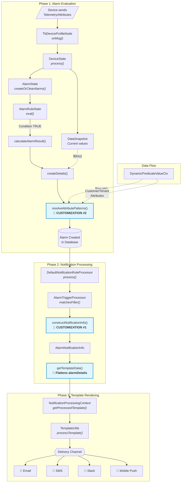

# ThingsBoard

[![ThingsBoard Builds Server Status](https://img.shields.io/teamcity/build/e/ThingsBoard_Build?label=TB%20builds%20server&server=https%3A%2F%2Fbuilds.thingsboard.io&logo=data:image/png;base64,iVBORw0KGgoAAAANSUhEUgAAAEAAAABACAYAAACqaXHeAAAACXBIWXMAAALzAAAC8wHS6QoqAAAAGXRFWHRTb2Z0d2FyZQB3d3cuaW5rc2NhcGUub3Jnm+48GgAAB9FJREFUeJzVm3+MXUUVx7+zWwqEtnRLWisQ2lKVUisIQmsqYCohpUhpEGsFKSJJTS0qGiGIISJ/8CNGYzSaEKBQEZUiP7RgVbCVdpE0xYKBWgI2rFLZJZQWtFKobPfjH3Pfdu7s3Pvmzntv3/JNNr3bOXPO+Z6ZO3PumVmjFgEYJWmWpDmSZks6VtIESV3Zv29LWmGMubdVPgw7gEOBJcAaYC/18fd2+zyqngAwXdL7M9keSduMMXgyH5R0laRPSRpbwf62CrLDB8AAS4HnAqP2EvA1YBTwPuBnwP46I70H+DPwALAS+B5wBTCu3VyHIJvG98dMX+B/BW1vAvcAnwdmAp3t5hWFbORXR5AvwmPARcCYdnNJAnCBR+gd7HQ9HZgLfAt4PUB8AzCv3f43DGCTQ6o/RAo43gtCL2Da4W9TAUwEBhxiPymRvcabAR8eTl+biQ7neYokdyTXlvR7xPt9etM8GmZ0FDxL+WD42FdBdkTDJd0jyU1wzi7pd473e0+qA8AM4AbgkrK1BDgOWAc8ChyTaq+eM5ud93ofcHpAZiY2sanhZaDDaTfAZ7HJUmlWCJzm6bqLQM6QBanXkfthcxgPNbTEW9z2AT8AzgTmANdikxwXX/d0XOi0bQEmFNj6GPAfhuKnXkB98kNsNjsITwacKkI3MNrrf4UnswXoiiRfwyqgo4D8L2hVZglMw456DDYCRwR0jCH/KuWCgE2oysjX8KsA+V+2jHzm3CrP4PMBx/4JfAU4qETP+EAQ/gKcA/w7gnwNbl5yD7bG0DLyM7DZXw3d2f9PA+YD5wIzK+gLBSEFA/XIA2cAVwLvbSQAt3mGP5Gs7IDO8dg1ZYDGcAfOwujZuIwDn+ObUx09hHx+v7Eh5nndCyIIDgBbgd0lMiv9IABfIF+LeDnVyU97xj5XR/6bwI5sZEaXyH2UuHd+WSbfRXktYjAIAfL9wGdSA/Cgo+gtSio12IKJa3hNKAgZ+TciyL+AlwECKzI/ioLgTvsa+YtTyXeSz8ZW15E3wN88p3JBwCZNMeShIKkBTsRmmSG4a0o/sDSJfGboBE/5pRF9pgI9oSBUJP8mXpLk2bm6pO9Aw+QzI8s8xVFbXRaEf3h911cgD7Cyjg0/L/GxnoLdoUoA3O1vDxUyLWyO4AehCpYX6D2L/LpUhtsaCkIWxRoeT+g/DVsqT8EWYDowC5jh6FxUUc+tJJblOmSPqWp4JUFHl6TDUoxLOlnSdknPSnK3sA2S9lfQs0zS7SkzwQ/A61U6A6dKWufpSMVg5mmMeUPSXyv2v0zSN6oa7ZAdwRqiA5CRf0TS+KpGAxiQ1OFN4z8l6PErVXUxSvmp1hvTqUnk35adPWskPWSM6fPaq84ASXqscg/gi9gcvJuC6o0nfwrhw5EYvIpNn88HStcN4M6KulfTys/lzKlO0lb8P2Lrf6VbLDAF+DLweEX998aSx372bwP6gPlVA3BEAvm9FJwVYtPqjwDXA08n6AZbOYoeeeAWp++mSlPGGLMLeFjSuRW6Iektx4GDJc2TdJ6khZKOruKDh/skXWSM6a/Q5yjn+dDKFrE1vw0VR2m2039x4kj7uJ+SslyJ/+7rtaly4mCM+a+kBaq2TbnVpfWy216jmCzpkIR+7kK/MymHNsbslX0NYoMweMpsjNklaWuKXQ9zJf2eOocvAbzHee5N/ojIgvBVxY3madh3v4b1iWZ/o3zw5kpaS+SFDGCq8jPguUQ/CmsCZfi403dhwjv/AHAQMAl41mvbGBMEhq4/c1PJTwmQr1f7u97pfzj5EnwUead/KAg/ivD7Zkf+HSBpFwiRfwibI3SXkOj29PgEivAggdU+C8JWR+6+CN9dm1tSyHcBLwbIj87ax1Kcxe0DJmVyY4CdEeR/TXnVeRLwc+C3wHF1fP+Qp/uGlABc6Cl5mPziVi8IzwDfAZ6KIN9LyhQt9v1GT/+sFCXTOVBBXuOTd+TGkp+eqWjKSTBwMPAvR+9TjSibjK35l93mWIxdZFKOxPzFseEgAJd7Olt6v+AC8jdIqwRhLbZM758HRH3tYa/vnoqtKZ4JHIk99tvh6HqNVl3RLSB/JfBEBPnBwxXsJ2uf176qxO7hwE3ALq/PfuyVXhdXt4r8+QHyK7K2cXWCMLiTOPqODwTh2IDdD2CP12LwCnUKMankO8kfiAySd2SKgjCEfEEQ+nznsZc7eyLJA9zddPKZIx0c2NcHgMsL5MZhr83XULiTeCSXAEcG2m4PjPCXsEWWBdhbZ/4h6knN4u07Mxv4MbCojtxo7DW6RTRwopMFxt0xeoCJAblLvCDdlWpzRAG42CO2sET2UUfuVbetsYPF9mKq8zwg6Q8lsm7bRJxt8N0cAPdar5FUupYU9X03B2C782wknVUi+0nneacxZk9rXBpGABO8RXA72demJ7fcWyvubIe/TQN2y11MuJ6wA5v3z8HeMbjba+8n5StwJCDb9lYUEI/Fde3mEQ1svnBKRvp32K/LEPYQd1z3XQJfsG3/Sw/gKElLZev8tb8rnizpBEmF1SDZ06ZbJN0saa+kayQtV77qi6QnJF1njFnXdOebAcIXssvQB3yfcGrcCZwEnAfMC8mMKGArNUVT28VubF4/nyZflx8Jr8BVkr4tm83tzn5ek/S8pM2SnpT0gv8H283C/wGTFfhGtexQwQAAAABJRU5ErkJggg==&labelColor=305680)](https://builds.thingsboard.io/viewType.html?buildTypeId=ThingsBoard_Build&guest=1)

ThingsBoard is an open-source IoT platform for data collection, processing, visualization, and device management.


## Documentation

ThingsBoard documentation is hosted on [thingsboard.io](https://thingsboard.io/docs).

## IoT use cases

[**Smart energy**](https://thingsboard.io/smart-energy/)
[](https://thingsboard.io/smart-energy/)

[**SCADA Swimming pool**](https://thingsboard.io/use-cases/scada/)
[](https://thingsboard.io/use-cases/scada/)

[**Fleet tracking**](https://thingsboard.io/fleet-tracking/)
[](https://thingsboard.io/fleet-tracking/)

[**Smart farming**](https://thingsboard.io/smart-farming/)
[](https://thingsboard.io/smart-farming/)

[**IoT Rule Engine**](https://thingsboard.io/docs/user-guide/rule-engine-2-0/re-getting-started/)
[](https://thingsboard.io/docs/user-guide/rule-engine-2-0/re-getting-started/)

[**Smart metering**](https://thingsboard.io/smart-metering/)
[](https://thingsboard.io/smart-metering/)

## Getting Started

Collect and Visualize your IoT data in minutes by following this [guide](https://thingsboard.io/docs/getting-started-guides/helloworld/).

## Support

 - [Stackoverflow](http://stackoverflow.com/questions/tagged/thingsboard)

## NauticSensors Customizations

This fork includes the following custom patches for NauticSensors BlueStar:

### 1. Alarm Notification Enhancements (`fd69e27599`)

Added new template variables for alarm notifications:

- `${alarmOriginatorLabel}` - The device label (falls back to device name if null)
- `${alarmDetails.*}` - Access to alarm details fields (e.g., `${alarmDetails.measuredValue}`, `${alarmDetails.threshold}`)

**Files modified:**
- `application/.../AlarmTriggerProcessor.java` - Populates new fields from AlarmInfo
- `common/data/.../AlarmNotificationInfo.java` - Added alarmOriginatorLabel and alarmDetails with JSON flattening

### 2. Server Attribute Substitution in Alarm Details

Added support for `${ss:attributeName}` pattern in alarm details, allowing dynamic threshold values from server-scope attributes to be included in alarm context.

Previously, only telemetry values (`${key}`) could be substituted in alarm details. Now both patterns work:
- `${key}` - Substitutes telemetry value
- `${ss:attributeName}` - Substitutes server-scope attribute value

**Attribute lookup hierarchy:**
1. Device attributes (from dataSnapshot)
2. Customer attributes (via `dynamicPredicateValueCtx.getCustomerValue()`)
3. Tenant attributes (via `dynamicPredicateValueCtx.getTenantValue()`)

This inheritance chain matches the behavior of dynamic alarm threshold values when `inherit: true` is configured in the device profile.

**File modified:**
- `rule-engine/.../AlarmState.java` - Added `resolveAttributePatterns()` method with device/customer/tenant fallback

This addresses ThingsBoard limitation documented in [issue #4102](https://github.com/thingsboard/thingsboard/issues/4102).

---

## Alarm Flow Architecture

This section documents the complete flow from alarm triggering through notification delivery, explaining how the NauticSensors customizations integrate with ThingsBoard's architecture.

### Flow Overview (Mermaid)



### Flow Overview (ASCII)

```
┌─────────────────────────────────────────────────────────────────────────────────┐
│                           ALARM EVALUATION PHASE                                │
├─────────────────────────────────────────────────────────────────────────────────┤
│                                                                                 │
│  Device Telemetry/Attributes                                                    │
│           │                                                                     │
│           ▼                                                                     │
│  ┌─────────────────────┐                                                        │
│  │  TbDeviceProfileNode │  ◄── Entry point: receives device messages            │
│  └──────────┬──────────┘                                                        │
│             │                                                                   │
│             ▼                                                                   │
│  ┌─────────────────────┐      ┌─────────────────┐                               │
│  │     DeviceState     │─────►│   DataSnapshot  │  ◄── Holds current values     │
│  └──────────┬──────────┘      └─────────────────┘                               │
│             │                          │                                        │
│             ▼                          ▼                                        │
│  ┌─────────────────────┐      ┌─────────────────┐                               │
│  │     AlarmState      │◄────►│ AlarmRuleState  │  ◄── Evaluates conditions     │
│  └──────────┬──────────┘      └─────────────────┘                               │
│             │                                                                   │
│             │ createDetails() + resolveAttributePatterns() ◄── CUSTOMIZATION    │
│             ▼                                                                   │
│  ┌─────────────────────┐                                                        │
│  │   Alarm Created     │                                                        │
│  └──────────┬──────────┘                                                        │
│             │                                                                   │
└─────────────┼───────────────────────────────────────────────────────────────────┘
              │
              ▼
┌─────────────────────────────────────────────────────────────────────────────────┐
│                         NOTIFICATION PROCESSING PHASE                           │
├─────────────────────────────────────────────────────────────────────────────────┤
│                                                                                 │
│  ┌───────────────────────────────┐                                              │
│  │ DefaultNotificationRuleProcessor │  ◄── Routes alarm to notification rules  │
│  └──────────────┬────────────────┘                                              │
│                 │                                                               │
│                 ▼                                                               │
│  ┌───────────────────────────────┐      ┌───────────────────────┐               │
│  │    AlarmTriggerProcessor      │─────►│  AlarmNotificationInfo │              │
│  └───────────────────────────────┘      └───────────┬───────────┘               │
│                                                     │                           │
│         constructNotificationInfo() ◄── CUSTOMIZATION (adds originatorLabel,   │
│                                          alarmDetails.*)                        │
│                                                     │                           │
│                                                     ▼                           │
│                                         ┌───────────────────────┐               │
│                                         │    getTemplateData()  │               │
│                                         └───────────┬───────────┘               │
│                                                     │                           │
│                 Flattens alarmDetails JSON ◄── CUSTOMIZATION                    │
│                                                     │                           │
└─────────────────────────────────────────────────────┼───────────────────────────┘
                                                      │
                                                      ▼
┌─────────────────────────────────────────────────────────────────────────────────┐
│                           TEMPLATE RENDERING PHASE                              │
├─────────────────────────────────────────────────────────────────────────────────┤
│                                                                                 │
│  ┌───────────────────────────────┐      ┌───────────────────────┐               │
│  │ NotificationProcessingContext │─────►│    TemplateUtils      │               │
│  └───────────────────────────────┘      └───────────┬───────────┘               │
│                                                     │                           │
│         processTemplate() replaces ${variables}     │                           │
│                                                     ▼                           │
│                                         ┌───────────────────────┐               │
│                                         │  NotificationChannel  │               │
│                                         │  (Email/SMS/Slack/..) │               │
│                                         └───────────────────────┘               │
│                                                                                 │
└─────────────────────────────────────────────────────────────────────────────────┘
```

### Phase 1: Alarm Evaluation

#### TbDeviceProfileNode
**File:** `rule-engine/rule-engine-components/.../profile/TbDeviceProfileNode.java`

The entry point for alarm processing. This rule node:
- Maintains a `ConcurrentHashMap` of `DeviceState` instances (one per device)
- Receives incoming device messages (telemetry, attributes)
- Schedules periodic alarm harvesting (every 1 minute) for duration/repeating conditions

**Key methods:**
- `onMsg()` - Processes incoming device messages
- `getOrCreateDeviceState()` - Creates or retrieves device state
- `harvestAlarms()` - Periodic alarm evaluation

#### DeviceState
**File:** `rule-engine/rule-engine-components/.../profile/DeviceState.java`

Manages all alarm-related state for a single device:
- Holds the `DataSnapshot` with current telemetry/attribute values
- Maintains `AlarmState` instances for each alarm type defined in the device profile
- Coordinates attribute lookups via `DynamicPredicateValueCtx`

**Key methods:**
- `process()` - Routes messages to appropriate handlers
- `processTelemetryUpdate()` - Merges telemetry into DataSnapshot, triggers alarm evaluation
- `processAttributes()` - Merges attributes into DataSnapshot, triggers alarm evaluation

#### DataSnapshot
**File:** `rule-engine/rule-engine-components/.../profile/DataSnapshot.java`

A point-in-time snapshot of device data used for alarm condition evaluation:

```java
class DataSnapshot {
    long ts;                                           // Timestamp of latest update
    Set<AlarmConditionFilterKey> keys;                 // Monitored keys
    Map<AlarmConditionFilterKey, EntityKeyValue> values; // Current values
}
```

**Contains:**
- Telemetry values (temperature, voltage, etc.)
- Device attributes (all scopes: CLIENT, SHARED, SERVER)
- Entity fields (device name, type, label, created time)

**How it's populated:**
1. On first message: `fetchLatestValues()` loads from database
2. On subsequent messages: values are merged incrementally
3. Only keys referenced in alarm conditions are tracked

#### AlarmState
**File:** `rule-engine/rule-engine-components/.../profile/AlarmState.java`

Manages the lifecycle of a single alarm type:

```java
class AlarmState {
    DeviceProfileAlarm alarmDefinition;              // Alarm configuration
    List<AlarmRuleState> createRulesSortedBySeverityDesc; // Create rules by severity
    AlarmRuleState clearState;                       // Clear rule
    Alarm currentAlarm;                              // Active alarm (if any)
    DataSnapshot dataSnapshot;                       // Current device data
    DynamicPredicateValueCtx dynamicPredicateValueCtx; // For customer/tenant lookups
}
```

**Key methods:**
- `process()` - Main evaluation entry point
- `createOrClearAlarms()` - Evaluates all rules, creates/clears alarms
- `calculateAlarmResult()` - Creates or updates alarm in database
- `createDetails()` - **Builds alarm details with variable substitution**

##### createDetails() - Where Customization #2 Happens

```java
private JsonNode createDetails(AlarmRuleState ruleState) {
    String alarmDetailsStr = ruleState.getAlarmRule().getAlarmDetails();

    // Step 1: Replace ${key} with telemetry values from DataSnapshot
    for (var keyFilter : ruleState.getAlarmRule().getCondition().getCondition()) {
        EntityKeyValue value = dataSnapshot.getValue(keyFilter.getKey());
        if (value != null) {
            alarmDetailsStr = alarmDetailsStr.replaceAll(
                "\\$\\{" + keyFilter.getKey().getKey() + "}",
                getValueAsString(value)
            );
        }
    }

    // Step 2: CUSTOMIZATION - Resolve ${ss:attributeName} patterns
    alarmDetailsStr = resolveAttributePatterns(alarmDetailsStr);

    return newDetails.put("data", alarmDetailsStr);
}
```

##### resolveAttributePatterns() - NauticSensors Addition

```java
private String resolveAttributePatterns(String alarmDetailsStr) {
    Pattern pattern = Pattern.compile("\\$\\{ss:([^}]+)\\}");
    Matcher matcher = pattern.matcher(alarmDetailsStr);
    StringBuffer result = new StringBuffer();  // Accumulates the result string

    while (matcher.find()) {
        String attributeName = matcher.group(1);

        // 1. Try device attributes (from DataSnapshot)
        EntityKeyValue value = dataSnapshot.getValue(
            new AlarmConditionFilterKey(ATTRIBUTE, attributeName));

        // 2. Fall back to customer attributes
        if (value == null && dynamicPredicateValueCtx != null) {
            value = dynamicPredicateValueCtx.getCustomerValue(attributeName);
        }

        // 3. Fall back to tenant attributes
        if (value == null && dynamicPredicateValueCtx != null) {
            value = dynamicPredicateValueCtx.getTenantValue(attributeName);
        }

        // Replace pattern with value, or keep original if not found
        if (value != null) {
            matcher.appendReplacement(result, Matcher.quoteReplacement(getValueAsString(value)));
        } else {
            matcher.appendReplacement(result, Matcher.quoteReplacement(matcher.group(0)));
        }
    }
    matcher.appendTail(result);  // Append any remaining text after last match
    return result.toString();
}
```

#### DynamicPredicateValueCtx
**File:** `rule-engine/rule-engine-components/.../profile/DynamicPredicateValueCtxImpl.java`

Provides customer/tenant attribute lookups:

```java
class DynamicPredicateValueCtxImpl {
    EntityKeyValue getTenantValue(String key) {
        return getValue(tenantId, key);  // SERVER_SCOPE attributes
    }

    EntityKeyValue getCustomerValue(String key) {
        return customerId.isNullUid() ? null : getValue(customerId, key);
    }
}
```

This is the same mechanism used for dynamic alarm thresholds with `inherit: true`.

### Phase 2: Notification Processing

Once an alarm is created/updated/cleared, it flows through the rule chain and triggers notification processing.

#### DefaultNotificationRuleProcessor
**File:** `application/.../notification/rule/DefaultNotificationRuleProcessor.java`

Routes alarms to matching notification rules:

```java
void process(NotificationRuleTrigger trigger) {
    // 1. Find all notification rules for this trigger type
    // 2. Filter by alarm type, severity, action
    // 3. Apply deduplication strategy
    // 4. Construct notification info via trigger processor
    // 5. Submit notification requests
}
```

#### AlarmTriggerProcessor
**File:** `application/.../notification/rule/trigger/AlarmTriggerProcessor.java`

Builds `AlarmNotificationInfo` from the alarm:

```java
RuleOriginatedNotificationInfo constructNotificationInfo(AlarmTrigger trigger) {
    AlarmInfo alarmInfo = trigger.getAlarmUpdate().getAlarm();

    return AlarmNotificationInfo.builder()
        .alarmId(alarmInfo.getUuidId())
        .alarmType(alarmInfo.getType())
        .alarmOriginator(alarmInfo.getOriginator())
        .alarmOriginatorName(alarmInfo.getOriginatorName())
        .alarmOriginatorLabel(alarmInfo.getOriginatorLabel())  // ◄── CUSTOMIZATION
        .alarmSeverity(alarmInfo.getSeverity())
        .alarmDetails(alarmInfo.getDetails())                   // ◄── CUSTOMIZATION
        .build();
}
```

#### AlarmNotificationInfo
**File:** `common/data/.../notification/info/AlarmNotificationInfo.java`

Converts alarm data to template variables:

```java
class AlarmNotificationInfo {
    String alarmOriginatorLabel;  // ◄── CUSTOMIZATION: Added field
    JsonNode alarmDetails;        // ◄── CUSTOMIZATION: Added field

    Map<String, String> getTemplateData() {
        Map<String, String> data = new HashMap<>();

        // Standard variables
        data.put("alarmType", alarmType);
        data.put("alarmSeverity", alarmSeverity.name().toLowerCase());
        data.put("alarmOriginatorName", alarmOriginatorName);

        // CUSTOMIZATION: originatorLabel with fallback
        data.put("alarmOriginatorLabel",
            alarmOriginatorLabel != null ? alarmOriginatorLabel : alarmOriginatorName);

        // CUSTOMIZATION: Flatten alarmDetails JSON
        if (alarmDetails != null) {
            JsonNode dataNode = alarmDetails.get("data");
            if (dataNode != null && dataNode.isTextual()) {
                // Parse JSON string and flatten with "alarmDetails." prefix
                JsonNode parsed = mapper.readTree(dataNode.asText());
                addJsonNodeToTemplateData(data, "alarmDetails", parsed);
            }
        }

        return data;
    }
}
```

### Phase 3: Template Rendering

#### NotificationProcessingContext
**File:** `application/.../notification/NotificationProcessingContext.java`

Processes notification templates with variable substitution:

```java
class NotificationProcessingContext {
    T getProcessedTemplate(NotificationDeliveryMethod method) {
        // 1. Get template for delivery method
        // 2. Build context map from notification info
        // 3. Add recipient-specific variables
        // 4. Call TemplateUtils.processTemplate()
    }
}
```

#### TemplateUtils
**File:** `common/data/.../util/TemplateUtils.java`

The variable substitution engine:

```java
public static String processTemplate(String template, Map<String, String> context) {
    // Pattern: ${variableName} or ${variableName:function}
    Pattern pattern = Pattern.compile("\\$\\{(.+?)(:[a-zA-Z]+)?}");

    // For each match:
    // 1. Look up key in context map
    // 2. Apply optional function (upperCase, lowerCase, capitalize)
    // 3. Replace pattern with value
}
```

**Available functions:** `upperCase`, `lowerCase`, `capitalize`

### Complete Variable Flow Example

Consider an alarm with these settings:

**Device Profile Alarm Details:**
```
Temperature ${temperature} exceeded threshold ${ss:tempThreshold}
```

**Notification Template:**
```
Alert: ${alarmType} on ${alarmOriginatorLabel}
Details: ${alarmDetails.data}
Severity: ${alarmSeverity:upperCase}
```

**Flow:**

1. **AlarmState.createDetails():**
   - `${temperature}` → Replaced with `45.5` from DataSnapshot
   - `${ss:tempThreshold}` → Replaced with `40.0` from device/customer/tenant attributes
   - Result stored in `alarm.details.data`: `"Temperature 45.5 exceeded threshold 40.0"`

2. **AlarmTriggerProcessor.constructNotificationInfo():**
   - Copies `alarmInfo.details` (containing the resolved string)
   - Copies `alarmInfo.originatorLabel` (e.g., "Freezer Unit #3")

3. **AlarmNotificationInfo.getTemplateData():**
   - Returns map:
     ```
     alarmType → "High Temperature"
     alarmOriginatorLabel → "Freezer Unit #3"
     alarmDetails.data → "Temperature 45.5 exceeded threshold 40.0"
     alarmSeverity → "critical"
     ```

4. **TemplateUtils.processTemplate():**
   - Final notification:
     ```
     Alert: High Temperature on Freezer Unit #3
     Details: Temperature 45.5 exceeded threshold 40.0
     Severity: CRITICAL
     ```

### Key Classes Reference

| Class | Location | Purpose |
|-------|----------|---------|
| `TbDeviceProfileNode` | `rule-engine/.../profile/` | Entry point, manages device states |
| `DeviceState` | `rule-engine/.../profile/` | Per-device alarm state management |
| `DataSnapshot` | `rule-engine/.../profile/` | Current telemetry/attribute values |
| `AlarmState` | `rule-engine/.../profile/` | Alarm lifecycle, detail substitution |
| `AlarmRuleState` | `rule-engine/.../profile/` | Individual condition evaluation |
| `DynamicPredicateValueCtxImpl` | `rule-engine/.../profile/` | Customer/tenant attribute lookup |
| `DefaultNotificationRuleProcessor` | `application/.../notification/rule/` | Routes alarms to notification rules |
| `AlarmTriggerProcessor` | `application/.../notification/rule/trigger/` | Builds notification info from alarm |
| `AlarmNotificationInfo` | `common/data/.../notification/info/` | Alarm → template variables |
| `NotificationProcessingContext` | `application/.../notification/` | Template processing |
| `TemplateUtils` | `common/data/.../util/` | Variable substitution engine |
| `NotificationChannel` | `application/.../notification/channels/` | Delivery (Email, SMS, Slack, etc.) |

---

## Licenses

This project is released under [Apache 2.0 License](./LICENSE).

## How to build all

```
mvn -T 0.8C license:format clean install -DskipTests -Ddockerfile.skip=false
```

## How to build only the Web UI only

```bash
mvn -T 0.8C license:format clean install -DskipTests -Ddockerfile.skip=false -pl :web-ui -am
```

or simply

```bash
./build.sh msa/web-ui
```

## How to build tb-web-ui and tb-node only

```bash
mvn -e -T 0.8C license:format install -DskipTests -Ddockerfile.skip=false -pl :web-ui,:tb-node
```

or simply

```bash
./build.sh msa/web-ui,msa/tb-node
```

## How to build tb-web-ui, tb-node, and tb-progres only

```bash
mvn -e -T 0.8C license:format install -DskipTests -Ddockerfile.skip=false -pl org.thingsboard.msa:web-ui,org.thingsboard.msa:tb-node,org.thingsboard.msa:tb
```

or simply

```bash
./build.sh msa/web-ui,msa/tb-node,msa/tb
```
